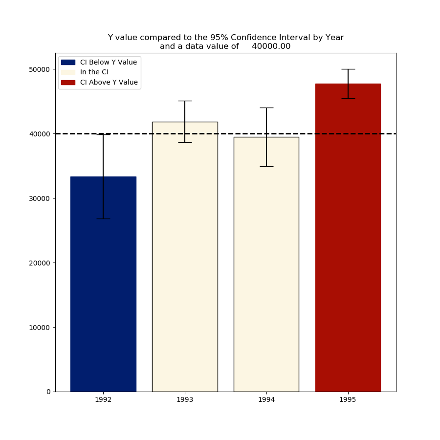

<h2 align="center"> 2015 Temperatures in Context </h2>

This was a demontration project to present the status of mean values in relation to an input value. The graph shows the 95% Confidence Intervals for 4 randomly generated sets of values.  The user can select a point in the graph that is used to determine a value to compare against the 4 distributions.  The Y Value of the point is compared against the 95% Confidence Intervale of the distributions and the graphed colors change according to the points relation to the distributions. 

